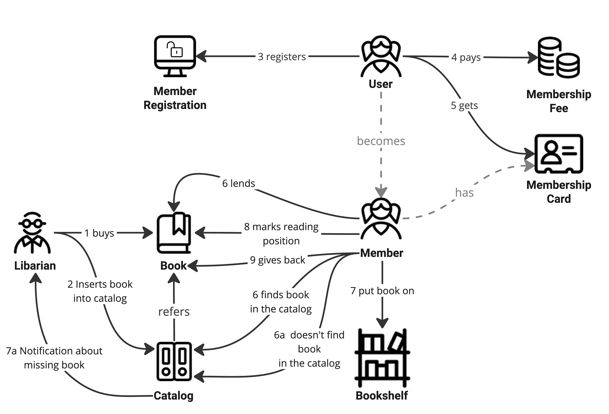
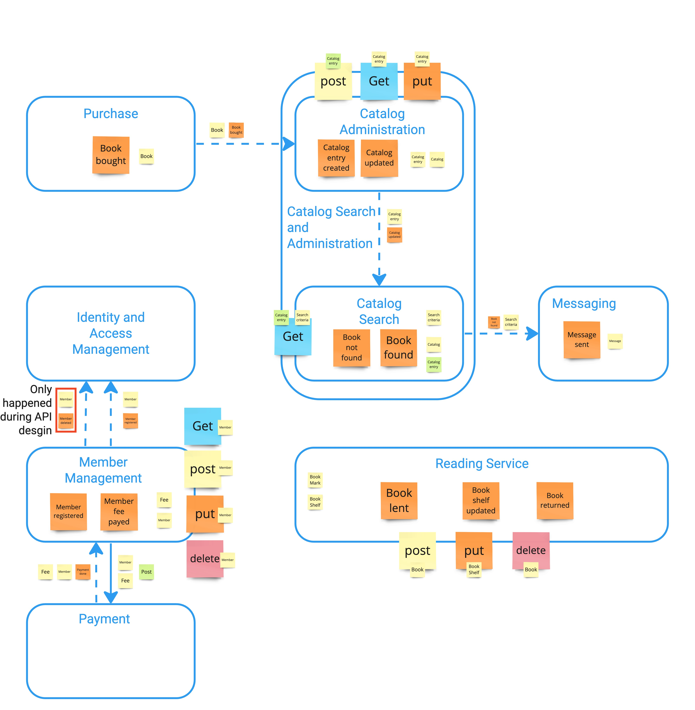

# Domain Driven API Design

This repository contains resources and examples which are used throughout training for Domain-Driven API Design.

## Online Library

The sample online library contains interfaces of a demo online library. The interfaces are designed in HTTP REST for synchronous interfaces and in the Kafka Protocol for asynchronous interfaces using events. 

When you find issues - missing parts, errors or any other type of enhancement or change - please create an issue or contact us directly.

Please contact [annegret.junker@codecentric.de](mailto:annegret.junker@codecentric.de) if you have any questions.

The principle architecture approach was developed with domain storytelling and event-storming sessions and is documented on a [Miro board](https://miro.com/app/board/uXjVNjGcwrQ=/?share_link_id=926523505719).

